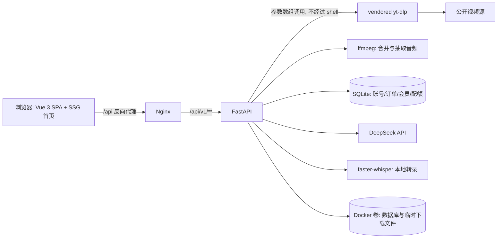

# VidNest

> 自托管的公开视频下载器与 AI 视频学习助手：粘贴公开视频链接，解析标题、封面、作者与清晰度后下载到本地，并基于字幕生成 AI 总结、思维导图与问答。

[](https://github.com/{{用户名}}/{{仓库名}}/blob/main/LICENSE)
[](https://github.com/{{用户名}}/{{仓库名}}/stargazers)
[](https://github.com/{{用户名}}/{{仓库名}}/issues)
[](https://github.com/{{用户名}}/{{仓库名}}/pulls)
[](https://github.com/{{用户名}}/{{仓库名}}/releases)
[](https://github.com/{{用户名}}/{{仓库名}}/actions)
[](https://fastapi.tiangolo.com/)
[](https://vuejs.org/)
[](https://www.python.org/)
[](https://docs.docker.com/compose/)

## 目录

- [项目简介](#项目简介)
- [特性](#特性)
- [界面预览](#界面预览)
- [平台支持与合规边界](#平台支持与合规边界)
- [技术栈](#技术栈)
- [系统架构](#系统架构)
- [安装](#安装)
- [快速开始](#快速开始)
- [本地开发](#本地开发)
- [使用示例](#使用示例)
- [配置项与环境变量](#配置项与环境变量)
- [API 与命令说明](#api-与命令说明)
- [测试与构建](#测试与构建)
- [目录结构](#目录结构)
- [常见问题](#常见问题)
- [路线图](#路线图)
- [合规与免责声明](#合规与免责声明)
- [参与贡献](#参与贡献)
- [English](#english)
- [需要补充的信息清单](#需要补充的信息清单)

## 项目简介

VidNest 是一个前后端分离的 Web 应用，面向**希望把自己有权保存的公开视频留存在本地的用户**（个人学习、素材归档、内容研究等场景）。

它解决的核心问题是：公开视频平台通常不提供统一的下载入口，而命令行工具（`yt-dlp`）对非技术用户门槛较高，桌面软件又难以在手机浏览器上使用。VidNest 把「解析 -> 选择清晰度 -> 交付文件」这条链路做成一个网页：粘贴链接即可看到标题、封面、作者、播放量与可选清晰度，随后由浏览器直连下载，或由服务端下载合并后交付。

在此基础上，项目还提供 AI 学习工作区：优先使用视频自带的公开字幕，无字幕时使用本地 Whisper 转录公开音频，再由 DeepSeek 生成摘要、视频大纲、核心知识点与思维导图，并支持带字幕时间戳引用的问答。

项目不修改 `yt-dlp` 上游源码，`ffmpeg` 仅用于合法的音视频合并与音频抽取。详细需求与设计见 [docs/requirements.md](docs/requirements.md) 与 [docs/architecture.md](docs/architecture.md)。

**目标用户**

- 需要在浏览器（含移动端）快速保存**公开、无 DRM、无需登录**视频的个人用户。
- 希望自托管、数据留在自己服务器上的开发者与团队。
- 需要把视频内容转成文字、摘要与思维导图的学习者和研究者。

**当前状态**：可部署的完整应用（下载链路 + 账号会员 + Stripe 计费 + AI 学习助手 + 首页 SEO/SSG），核心流程已有单元测试覆盖，暂未提供在线公共实例。

## 特性

**下载与交付**

- 单个 HTTP/HTTPS 公开链接解析，返回标题、封面、时长、作者、简介、平台与播放量。
- 格式按 `1080P / 720P / 480P / 360P` 去重筛选，优先 MP4、带音频且码率较高的媒体流。
- 两种交付模式：可直接播放的媒体源使用短期令牌 `302` 跳转；需要 `Referer`、`User-Agent` 或 `Origin` 的来源自动改用安全流式代理（支持 `Range` 请求，不携带 Cookie）。
- 音视频分离的自适应流自动转为服务端任务，由 `yt-dlp` + `ffmpeg` 合并为 MP4 后交付。
- 服务端下载任务提供进度、错误状态与 2 小时有效的临时交付地址。
- 同源封面代理，避免跨域、HTTP 封面或 `Referer` 校验导致封面不显示。
- VIP 批量下载，单次最多 10 条链接。

**账号、会员与计费**

- 邮箱 + 密码账号体系：密码使用 Argon2id 哈希，登录态为服务端持久会话 + `HttpOnly` Cookie，写操作校验 CSRF Token。
- 免费额度：每日 5 次下载、最高 720P；VIP 解锁更高分辨率（取决于来源实际提供的格式）、无限下载、批量下载与字幕能力。
- Stripe Checkout 提供一次性购买 30 天 VIP 与月度自动续费订阅，可通过 Stripe Customer Portal 取消订阅。
- Webhook 使用原始请求体验签、Event ID 去重、金额/币种复核与订阅事件时间戳防乱序回退。
- 用户、会话、订单、会员状态、每日配额、Webhook 事件与客服工单持久化到 SQLite。

**AI 视频学习助手**

- 自动发现字幕轨道，优先中文人工字幕，展示可核对时间戳的字幕转录。
- 无可用字幕轨道时，使用 `faster-whisper` 在本地临时转录公开音频，完成后删除临时音频。
- DeepSeek 生成摘要、视频大纲、核心知识点、关键词与思维导图，摘要支持 SSE 流式增量输出。
- 基于字幕证据的问答，回答附带可核验的时间范围引用。
- 字幕导出为 UTF-8 `SRT`（`HH:MM:SS,mmm` 时间戳）或 `TXT`。
- 思维导图支持 Markmap 缩放、拖动、全屏查看、复制 Mermaid、导出 SVG 与高清 PNG。

**安全与运维**

- SSRF 防护：仅允许 HTTP/HTTPS，DNS 解析后必须为全球公网 IP。
- 格式 ID 白名单，仅接受来自同一次解析结果的格式；子进程以参数数组调用且不经过 shell。
- 超时、并发数、文件大小与允许来源域名均可通过环境变量限制，临时记录与文件默认 2 小时清理。
- Docker Compose 一键部署：Nginx 托管前端并反代 `/api`，后端使用独立数据卷保存数据库与下载文件。
- 首页使用 SSG 预渲染，并提供 `robots.txt`、`sitemap.xml`、`llms.txt`、JSON-LD 与 Open Graph 元数据。

## 界面预览


- 项目主页 / 演示地址：[待补充：在线 Demo 链接；若为纯自托管项目，请写明「本项目无公共实例」]
- 演示视频或 GIF：[待补充：链接或文件路径]

## 平台支持与合规边界

仅处理用户有权保存的**公开、无 DRM、无需登录**内容；不接收用户 Cookie，不求解验证码、WAF 或平台反爬参数，不绕过 DRM 与付费墙。

| 平台 | 示例链接 | 当前状态 |
| --- | --- | --- |
| Bilibili | `https://www.bilibili.com/video/BV1xx411c7mD` | 已通过解析与下载链路验证，可返回作者、简介与播放量 |
| AcFun | `https://www.acfun.cn/v/ac35457073` | 已通过完整下载验证（MP4，约 13.2 MB） |
| 虎牙视频 | `https://www.huya.com/video/play/1002412640.html` | 已通过完整下载验证（MP4，约 864 KB） |
| 抖音 | `https://v.douyin.com/...` | 优先展开短链并调用公开元数据接口，失败时降级 `yt-dlp`；平台要求会话或反爬验证时返回明确提示 |
| 小红书 | `https://xhslink.com/...` | 展开短链并保留 `xsec_token`，交由内置 `yt-dlp` 提取器解析 |
| YouTube | `https://www.youtube.com/watch?v=...` | 使用 `yt-dlp-ejs` 与 Node.js 24 处理公开播放器 JS 挑战；平台要求「确认非机器人」时返回明确提示，不尝试规避 |

> 平台可用性取决于上游访问策略与内置 `yt-dlp` 版本，实际结果可能随平台调整而变化。完整说明见 [docs/platform-support.md](docs/platform-support.md)。

前端「试试」按钮固定使用上表中已完整验证的三个样本链接。

## 技术栈

| 层次 | 技术选型 |
| --- | --- |
| 前端 | Vue 3.5、Vite 6、TypeScript 5.7、Pinia、Vue Router、vite-ssg（首页 SSG）、Markmap、Mermaid、lucide-vue-next |
| 前端托管 | Nginx 1.27（静态资源 + `/api` 反向代理，SSE 关闭缓冲与缓存） |
| 后端 | Python 3.12、FastAPI 0.115、Uvicorn、httpx、Pydantic Settings |
| 媒体处理 | 内置 `yt-dlp`（vendored，当前 `2026.08.19`）+ `ffmpeg`；YouTube 播放器 JS 挑战场景需要 Node.js 24 |
| AI | DeepSeek（默认 `deepseek-flash`）、`faster-whisper` 1.1.1（本地 ASR）、Markmap |
| 数据存储 | SQLite（账号、会话、订单、会员、配额、Webhook 事件、工单）+ 内存任务与交付令牌（TTL 清理） |
| 支付 | Stripe Checkout、Stripe Webhook、Stripe Customer Portal |
| 测试 | pytest 8.3、pytest-asyncio、Vitest |
| 部署 | Docker、Docker Compose |

## 系统架构



核心请求流程：

1. 前端 `POST /api/v1/inspections` 提交链接；后端校验 URL、解析 DNS 并拦截非公网地址，再用 `yt-dlp --dump-single-json` 获取格式与元数据（Bilibili 额外查询公开详情接口补全作者、简介与播放量）。
2. 可直连的来源创建交付令牌，`GET /api/v1/deliveries/{token}` 默认 `302` 到媒体地址；需要特定请求头的来源改为流式代理。
3. 音视频分离或需要合并的格式创建服务端任务，前端轮询 `GET /api/v1/downloads/{id}` 获取进度与最终交付 URL。
4. AI 能力独立在 `/api/v1/ai` 路由下，基于解析结果的字幕或本地转录结果工作；任务与问答仅保存在内存中并按 TTL 清理。

## 安装

### 前置要求

| 方式 | 依赖 |
| --- | --- |
| Docker 部署（推荐） | Docker Engine 24+、Docker Compose v2 |
| 源码运行 | Python 3.12+、Node.js 20+（本地开发建议 24）、`ffmpeg` 且需在 `PATH` 中 |

Docker 镜像已内置 `ffmpeg`、Node.js 24 与 vendored `yt-dlp`，无需额外安装。

### 方式一：Docker Compose（推荐）

```bash
git clone https://github.com/{{用户名}}/{{仓库名}}.git
cd {{仓库名}}

# 可选：先把 Stripe / DeepSeek 等密钥写入根目录 .env，再启动
docker compose up --build
```

启动后访问 `http://localhost:8080`；健康检查：`GET /api/v1/health`。

### 方式二：源码运行

```bash
git clone https://github.com/{{用户名}}/{{仓库名}}.git
cd {{仓库名}}

# 后端依赖
cd backend
python -m venv .venv
.venv\Scripts\pip install -r requirements.txt   # Windows
# .venv/bin/pip install -r requirements.txt     # macOS / Linux

# 前端依赖
cd ../frontend
npm install
```

## 快速开始

最小可运行步骤（Docker）：

```bash
# 1. 构建并启动
docker compose up --build -d

# 2. 确认后端健康
curl http://localhost:8080/api/v1/health

# 3. 打开 http://localhost:8080
#    粘贴公开视频链接 -> 选择清晰度 -> 下载
```

命令行验证解析接口：

```bash
curl -X POST http://localhost:8080/api/v1/inspections \
  -H "Content-Type: application/json" \
  -d '{"url":"https://www.acfun.cn/v/ac35457073"}'
```

响应示例（截断）：

```json
{
  "inspection_id": "a1b2c3d4",
  "title": "示例视频标题",
  "thumbnail": "/api/v1/thumbnails/a1b2c3d4",
  "duration": 132.5,
  "author": "示例作者",
  "platform": "AcFun",
  "view_count": 12345,
  "formats": [
    { "id": "30080", "label": "1080p", "ext": "mp4", "resolution": "1920x1080", "direct_available": false }
  ],
  "expires_at": "2026-09-21T12:00:00Z"
}
```

> 解析与下载接口无需登录；`/api/v1/ai/*`、`/api/v1/billing/*`、`/api/v1/me` 需要账号登录。

## 本地开发

后端（热重载，监听 `http://127.0.0.1:8000`）：

```bash
cd backend
python -m venv .venv
.venv\Scripts\python -m uvicorn app.main:app --reload
# macOS / Linux: .venv/bin/python -m uvicorn app.main:app --reload
```

前端（Vite 开发服务器，监听 `http://127.0.0.1:5173`，`/api` 已代理到 `127.0.0.1:8000`）：

```bash
cd frontend
npm install
npm run dev
```

配置读取规则：后端从**项目根目录**的 `.env` 读取环境变量（前缀 `VIDNEST_`）。`.env` 已列入 `.gitignore`，请勿提交任何密钥。

## 使用示例

### 1. 解析链接并创建下载

```bash
# 解析：获取 inspection_id
INSPECTION_ID=$(curl -s -X POST http://localhost:8080/api/v1/inspections \
  -H "Content-Type: application/json" \
  -d '{"url":"https://www.bilibili.com/video/BV1xx411c7mD"}' | jq -r .inspection_id)

# 创建交付：mode=direct 优先直连/代理，mode=service 由服务端合并下载
curl -X POST http://localhost:8080/api/v1/downloads \
  -H "Content-Type: application/json" \
  -H "X-Idempotency-Key: $(uuidgen)" \
  -d "{\"inspection_id\":\"$INSPECTION_ID\",\"format_id\":\"30080\",\"mode\":\"service\"}"

# 轮询任务进度
curl http://localhost:8080/api/v1/downloads/<TASK_ID>
```

### 2. 交付下载文件

```bash
# 交付令牌：默认 302 到媒体源，或由服务端流式代理（支持 Range）
curl -L -o video.mp4 "http://localhost:8080/api/v1/deliveries/<TOKEN>"
```

### 3. 注册、登录与 CSRF

```bash
# 注册：返回用户信息与 csrf_token，并写入会话 Cookie
curl -c cookies.txt -X POST http://localhost:8080/api/v1/auth/register \
  -H "Content-Type: application/json" \
  -d '{"email":"you@example.com","password":"<YOUR_PASSWORD>"}'

# 查询当前账号、会员状态与剩余免费额度
curl -b cookies.txt http://localhost:8080/api/v1/me

# 写操作需要携带 CSRF Token（取自 /api/v1/me 的 csrf_token）
curl -b cookies.txt -X POST http://localhost:8080/api/v1/ai/summaries \
  -H "Content-Type: application/json" \
  -H "X-CSRF-Token: <CSRF_TOKEN>" \
  -d '{"inspection_id":"<INSPECTION_ID>","subtitle_id":"<SUBTITLE_ID>"}'
```

密码规则：至少 10 位，且包含大写字母、小写字母、数字、符号中的至少三类。

### 4. AI 学习：字幕、总结、问答与导出

```bash
# 1. 列出可用字幕轨道
curl -b cookies.txt \
  http://localhost:8080/api/v1/ai/inspections/<INSPECTION_ID>/subtitle-tracks

# 2. 获取字幕转录（含时间戳）
curl -b cookies.txt \
  http://localhost:8080/api/v1/ai/inspections/<INSPECTION_ID>/subtitle-tracks/<SUBTITLE_ID>

# 3. 导出 SRT / TXT
curl -b cookies.txt -o subtitle.srt \
  "http://localhost:8080/api/v1/ai/inspections/<INSPECTION_ID>/subtitle-tracks/<SUBTITLE_ID>/download?format=srt"

# 4. SSE 流式获取视频大纲
curl -N -b cookies.txt -H "Accept: text/event-stream" \
  http://localhost:8080/api/v1/ai/summaries/<SUMMARY_ID>/stream

# 5. 结构化总结结果（含思维导图与 Mermaid）
curl -b cookies.txt http://localhost:8080/api/v1/ai/summaries/<SUMMARY_ID>

# 6. 基于字幕证据的问答
curl -b cookies.txt -X POST \
  http://localhost:8080/api/v1/ai/summaries/<SUMMARY_ID>/questions \
  -H "Content-Type: application/json" \
  -H "X-CSRF-Token: <CSRF_TOKEN>" \
  -d '{"question":"这个视频的核心结论是什么？"}'
```

### 5. VIP 批量下载

```bash
curl -b cookies.txt -X POST http://localhost:8080/api/v1/batch-downloads \
  -H "Content-Type: application/json" \
  -H "X-CSRF-Token: <CSRF_TOKEN>" \
  -d '{"urls":["https://www.acfun.cn/v/ac35457073","https://www.huya.com/video/play/1002412640.html"]}'
```

## 配置项与环境变量

后端配置统一使用 `VIDNEST_` 前缀，从项目根目录 `.env` 读取；Docker Compose 会将这些变量透传给 `backend` 服务。示例：

```bash
# ---------- 通用与下载 ----------
VIDNEST_DOWNLOAD_DIR=/data/downloads
VIDNEST_DATABASE_PATH=/data/vidnest.db
VIDNEST_TTL_SECONDS=7200
VIDNEST_MAX_FILE_SIZE_MB=2048
VIDNEST_MAX_CONCURRENT_DOWNLOADS=2
VIDNEST_ALLOWED_HOSTS=
VIDNEST_FRONTEND_URL=http://localhost:8080
VIDNEST_SESSION_COOKIE_SECURE=false

# ---------- Stripe（会员与计费） ----------
VIDNEST_STRIPE_SECRET_KEY=<YOUR_STRIPE_SECRET_KEY>
VIDNEST_STRIPE_WEBHOOK_SECRET=<YOUR_STRIPE_WEBHOOK_SECRET>
VIDNEST_STRIPE_ONE_TIME_PRICE_ID=<YOUR_STRIPE_ONE_TIME_PRICE_ID>
VIDNEST_STRIPE_SUBSCRIPTION_PRICE_ID=<YOUR_STRIPE_SUBSCRIPTION_PRICE_ID>
VIDNEST_STRIPE_AMOUNT_CENTS=990
VIDNEST_STRIPE_CURRENCY=cny

# ---------- AI（DeepSeek 与本地转录） ----------
VIDNEST_DEEPSEEK_API_KEY=<YOUR_DEEPSEEK_API_KEY>
VIDNEST_DEEPSEEK_BASE_URL=https://api.deepseek.com
VIDNEST_DEEPSEEK_MODEL=deepseek-flash
VIDNEST_AI_ENABLE_AUDIO_TRANSCRIPTION=true
VIDNEST_AI_ASR_MODEL=base
```

**通用与下载**

| 变量 | 默认值 | 说明 |
| --- | --- | --- |
| `VIDNEST_DOWNLOAD_DIR` | `/tmp/vidnest-downloads`（Compose 为 `/data/downloads`） | 临时下载目录，容器中挂载到数据卷 |
| `VIDNEST_DATABASE_PATH` | `/tmp/vidnest.db`（Compose 为 `/data/vidnest.db`） | SQLite 数据库路径 |
| `VIDNEST_TTL_SECONDS` | `7200` | 临时任务、解析结果与交付令牌的有效期（秒） |
| `VIDNEST_INSPECTION_TIMEOUT_SECONDS` | `45` | 单次解析超时（秒） |
| `VIDNEST_DOWNLOAD_TIMEOUT_SECONDS` | `1800` | 服务端下载任务超时（秒） |
| `VIDNEST_MAX_FILE_SIZE_MB` | `2048` | 单文件大小上限（MB） |
| `VIDNEST_MAX_CONCURRENT_DOWNLOADS` | `2` | 并发服务端下载数 |
| `VIDNEST_ALLOWED_HOSTS` | 空（不限制） | 允许解析的来源域名白名单，逗号分隔 |
| `VIDNEST_FRONTEND_URL` | `http://localhost:8080` | 前端地址，用于支付成功/取消跳转 |
| `VIDNEST_SESSION_TTL_SECONDS` | `2592000` | 会话有效期（秒，默认 30 天） |
| `VIDNEST_SESSION_COOKIE_SECURE` | `false` | 生产环境使用 HTTPS 时必须设为 `true` |
| `VIDNEST_FREE_DAILY_DOWNLOADS` | `5` | 免费用户每日下载次数 |
| `VIDNEST_FREE_MAX_HEIGHT` | `720` | 免费用户最高清晰度 |
| `VIDNEST_BATCH_MAX_ITEMS` | `10` | 单次批量下载最大条目数 |
| `VIDNEST_SUPPORT_EMAIL` | 代码中的默认值 | 客服与合规联系邮箱 |
| `VIDNEST_PORT` | `8080` | 仅 Docker Compose 使用，宿主机暴露端口 |

**Stripe 计费**

| 变量 | 默认值 | 说明 |
| --- | --- | --- |
| `VIDNEST_STRIPE_SECRET_KEY` | 空 | Stripe 密钥，只能配置在后端环境变量 |
| `VIDNEST_STRIPE_WEBHOOK_SECRET` | 空 | Webhook 验签密钥（`stripe listen` 输出或 Dashboard 配置） |
| `VIDNEST_STRIPE_ONE_TIME_PRICE_ID` | 空 | 一次性 30 天 VIP 的 Price ID |
| `VIDNEST_STRIPE_SUBSCRIPTION_PRICE_ID` | 空 | 月度订阅的 Price ID |
| `VIDNEST_STRIPE_AMOUNT_CENTS` | `990` | 期望金额（分），用于 Webhook 金额复核 |
| `VIDNEST_STRIPE_CURRENCY` | `cny` | 期望币种，用于 Webhook 币种复核 |

未配置 Stripe 时下载与解析仍可用，仅会员购买不可用。完整步骤见 [docs/billing-stripe.md](docs/billing-stripe.md)。

**AI 与转录**

| 变量 | 默认值 | 说明 |
| --- | --- | --- |
| `VIDNEST_DEEPSEEK_API_KEY` | 空 | 未配置时仅 AI 总结不可用，下载与解析不受影响 |
| `VIDNEST_DEEPSEEK_BASE_URL` | `https://api.deepseek.com` | DeepSeek 接口地址 |
| `VIDNEST_DEEPSEEK_MODEL` | `deepseek-flash` | 使用的模型 |
| `VIDNEST_DEEPSEEK_TIMEOUT_SECONDS` | `90` | 单次模型请求超时（秒） |
| `VIDNEST_DEEPSEEK_MAX_TOKENS` | `4096` | 单次生成上限 |
| `VIDNEST_AI_WORK_DIR` | `/tmp/vidnest-ai` | AI 临时工作目录 |
| `VIDNEST_AI_TTL_SECONDS` | `7200` | AI 任务与问答的内存保留时间（秒） |
| `VIDNEST_AI_ENABLE_AUDIO_TRANSCRIPTION` | `true` | 无字幕时是否启用本地音频转录 |
| `VIDNEST_AI_ASR_MODEL` | `base` | faster-whisper 模型规格（首次使用会下载模型） |
| `VIDNEST_AI_ASR_TIMEOUT_SECONDS` | `1800` | 单次转录超时（秒） |
| `VIDNEST_AI_MAX_AUDIO_BYTES` | `268435456`（256 MB） | 允许转录的音频大小上限 |
| `VIDNEST_AI_MAX_TRANSCRIPT_CHARS` | `160000` | 字幕/转录文本长度上限 |
| `VIDNEST_AI_CHUNK_CHARS` | `24000` | 送入模型的分片长度 |
| `VIDNEST_AI_MAX_CONCURRENT_TASKS` | `1` | 并发 AI 任务数 |
| `VIDNEST_AI_MAX_SUBTITLE_BYTES` | `4194304`（4 MB） | 单条字幕轨道大小上限 |
| `VIDNEST_AI_SUBTITLE_TIMEOUT_SECONDS` | `60` | 字幕获取超时（秒） |

## API 与命令说明

基地址：`http://localhost:8080/api/v1`。除标注外均返回 JSON；标为「是」的写操作需要登录会话与 `X-CSRF-Token`。交互式文档在 `http://127.0.0.1:8000/docs`。

| 方法与路径 | 说明 | 鉴权 |
| --- | --- | --- |
| `GET /health` | 健康检查 | 否 |
| `POST /inspections` | 解析公开链接，返回元数据与可用格式 | 否 |
| `GET /thumbnails/{inspection_id}` | 同源封面代理（规避跨域与 Referer 限制） | 否 |
| `POST /downloads` | 创建交付：`mode=direct` 生成直连令牌，`mode=service` 创建服务端任务 | 否（受每日配额限制） |
| `GET /downloads/{task_id}` | 查询任务状态、进度、错误与交付 URL | 否 |
| `GET /deliveries/{token}` | 文件响应、`302` 跳转或流式代理（支持 `Range`） | 交付令牌 |
| `POST /batch-downloads` | VIP 批量创建下载任务 | 是 |
| `GET /batch-downloads/{batch_id}` | 查询批量任务与各条目状态 | 是 |
| `POST /auth/register` | 邮箱密码注册，建立 HttpOnly 会话（`201`） | 否 |
| `POST /auth/login` | 登录 | 否 |
| `POST /auth/logout` | 退出登录（`204`） | 是 |
| `GET /me` | 当前账号、会员状态、剩余免费额度与 CSRF Token | 是 |
| `POST /support/tickets` | 创建客服与合规工单 | 是 |
| `GET /billing/status` | 计费配置状态、会员信息与订单列表 | 是 |
| `POST /billing/checkout` | 创建 Stripe Checkout Session（一次性或订阅） | 是 |
| `POST /billing/portal` | 创建 Stripe Customer Portal 会话（管理或取消订阅） | 是 |
| `POST /billing/webhook` | Stripe Webhook，原始请求体验签且幂等 | Stripe 签名 |
| `GET /ai/inspections/{id}/subtitle-tracks` | 可用字幕轨道列表 | 是 |
| `GET /ai/inspections/{id}/subtitle-tracks/{sid}` | 字幕转录内容（含时间戳） | 是 |
| `GET /ai/inspections/{id}/subtitle-tracks/{sid}/download?format=srt\|txt` | 导出字幕文件（UTF-8 文件名） | 是 |
| `POST /ai/inspections/{id}/subtitle-tracks/{sid}/translations` | DeepSeek 字幕翻译 | 是 |
| `POST /ai/summaries` | 创建 AI 总结任务（摘要、大纲、知识点、关键词、思维导图） | 是 |
| `GET /ai/summaries/{summary_id}` | 查询总结任务状态与结果（含 `stream_text`） | 是 |
| `GET /ai/summaries/{summary_id}/stream` | SSE 流式输出视频大纲（Nginx 已关闭缓冲与缓存） | 是 |
| `POST /ai/summaries/{summary_id}/questions` | 基于字幕证据的问答，返回时间范围引用 | 是 |

常用命令：

```bash
# Docker 部署
docker compose up --build -d
docker compose down

# 本机后端（热重载）
cd backend && .venv\Scripts\python -m uvicorn app.main:app --reload

# 本机前端
cd frontend && npm run dev

# 本地 Stripe Webhook 转发
stripe listen --forward-to http://localhost:8000/api/v1/billing/webhook
```

## 测试与构建

```bash
# 后端单元测试（在 backend 目录执行）
python -m pytest tests -q

# 前端单元测试
cd frontend && npm test -- --run

# 前端生产构建（类型检查 + 首页 SSG 预渲染）
cd frontend && npm run build
```

最近一次记录：后端 27 项测试通过，前端测试通过，生产构建成功（构建时可能提示 Markmap 相关 chunk 体积较大，不阻断发布）。[待补充：以当前分支实测结果为准，并补充 CI 状态徽章链接]

## 目录结构

```text
.
├── backend/                    # FastAPI 后端
│   ├── app/
│   │   ├── main.py             # 应用入口、解析/下载/交付路由
│   │   ├── ytdlp.py            # yt-dlp 封装、格式筛选与平台适配
│   │   ├── models.py           # 下载相关请求/响应模型
│   │   ├── store.py            # 内存任务、解析结果与交付令牌
│   │   ├── security.py         # SSRF 防护、格式白名单、限流
│   │   ├── config.py           # 通用与下载配置（VIDNEST_ 前缀）
│   │   ├── auth.py             # 会话、CSRF 与权限依赖
│   │   ├── account_models.py   # 账号与会话模型
│   │   ├── account_router.py   # 注册、登录、当前账号、工单
│   │   ├── database.py         # SQLite 连接与建表
│   │   ├── billing.py          # Stripe Checkout、Portal 与 Webhook
│   │   ├── entitlements.py     # 会员权益与每日配额
│   │   ├── ai_router.py        # /api/v1/ai 路由
│   │   ├── ai_config.py        # AI 与 DeepSeek 配置
│   │   ├── ai_deepseek.py      # DeepSeek 调用与结构化输出
│   │   ├── ai_subtitles.py     # 字幕轨道发现与解析
│   │   ├── ai_transcription.py # faster-whisper 本地转录
│   │   ├── ai_store.py         # AI 任务内存存储与 TTL
│   │   └── ai_models.py        # AI 请求/响应模型
│   ├── tests/                  # pytest 测试用例
│   ├── vendor/yt-dlp/          # vendored yt-dlp 源码（请勿直接修改提取器）
│   ├── requirements.txt
│   └── Dockerfile
├── frontend/                   # Vue 3 + Vite 前端
│   ├── src/
│   │   ├── App.vue             # 首页、解析与下载交互
│   │   ├── api.ts              # API 客户端与类型定义
│   │   ├── api.test.ts         # Vitest 测试
│   │   ├── components/
│   │   │   ├── AiLearningWorkspace.vue  # 大纲、字幕、思维导图、问答
│   │   │   ├── MembershipCenter.vue     # 会员与订单
│   │   │   ├── AuthDialog.vue           # 登录与注册
│   │   │   └── SeoContent.vue           # 首页可索引正文
│   │   └── *.css               # 工作区、会员、响应式与 SEO 样式
│   ├── public/                 # favicon、robots.txt、sitemap.xml、llms.txt、OG 图
│   ├── index.html              # TDK、Open Graph 与 JSON-LD
│   ├── nginx.conf              # 静态托管与 /api 反向代理
│   ├── package.json
│   ├── Dockerfile
│   └── vite.config.ts          # 开发服务器与 /api 代理
├── docs/                       # 需求、架构、平台支持、AI、计费与 SEO 文档
├── docker-compose.yml          # backend + web(Nginx) 编排
├── .env                        # 本地密钥（已 gitignore，禁止提交）
└── README.md
```

## 常见问题

**Q：为什么某些链接解析失败或提示不可用？**

A：本服务只处理公开、无 DRM、无需登录的内容。当平台要求会话、Cookie 或反爬验证（例如 YouTube 的「确认非机器人」、部分抖音与小红书链接）时会返回明确提示，而不会尝试绕过。也可能是内置 `yt-dlp` 版本尚未适配该平台的最新变更。

**Q：下载的视频没有声音，或者只有画面/只有声音？**

A：YouTube 等平台通常提供音视频分离的自适应流。此类格式会自动创建为服务端任务，由 `yt-dlp` + `ffmpeg` 合并为 MP4 后再交付。

**Q：为什么交付链接只有 2 小时有效期？**

A：临时任务、解析结果与交付令牌默认 2 小时后清理，避免长期占用磁盘与产生失效链接。可通过 `VIDNEST_TTL_SECONDS` 调整。

**Q：AI 总结提示「尚未配置 DeepSeek API Key」？**

A：需要在环境中配置 `VIDNEST_DEEPSEEK_API_KEY`。未配置时下载与解析功能不受影响。

**Q：没有字幕的视频能生成总结吗？**

A：可以。若视频没有可下载的字幕轨道，且 `VIDNEST_AI_ENABLE_AUDIO_TRANSCRIPTION=true`，服务会把公开音频临时下载到本地用 Whisper 转录，完成后删除临时音频。首次使用会下载 ASR 模型，耗时较长。

**Q：可以上传自己的 Cookie 或登录态来下载更多内容吗？**

A：不支持。本项目不接收用户 Cookie，也不实现登录态伪造、验证码绕过或 DRM 绕过。

**Q：免费用户和 VIP 有什么区别？**

A：免费用户每日 5 次下载、最高 720P；VIP 解锁更高分辨率（取决于来源实际格式）、无限下载、批量下载、字幕下载、DeepSeek 翻译与 AI 学习能力。

**Q：前端与后端如何互相访问？**

A：Docker 部署时只暴露 Nginx 的 8080 端口，`/api` 反代到后端 8000 端口；本地开发时前端 5173 端口已把 `/api` 代理到 `127.0.0.1:8000`。

**Q：升级 `yt-dlp` 有什么注意事项？**

A：保持 `backend/vendor/yt-dlp` 为独立的 vendored 源码目录，不要修改其提取器代码；业务适配统一放在 `backend/app/ytdlp.py`。升级前先在测试环境验证 Bilibili、AcFun、虎牙样本，并回归封面代理、带请求头的流式代理、`Range` 请求与中文文件名。

**[待补充：其他高频问题]**

## 路线图

- [x] 视频解析、格式筛选与两种交付模式（直连令牌 / 流式代理）
- [x] 服务端下载任务、进度与临时交付地址
- [x] 账号会员体系、Stripe 一次性购买与订阅
- [x] AI 学习助手：字幕、总结、思维导图、问答与字幕导出
- [x] 首页 SEO/GEO 优化与 SSG 预渲染
- [ ] 补充对外部署所需的 IP 限流与可观测性（结构化日志、指标与告警）
- [ ] 增加 CI 工作流，自动运行后端 pytest、前端 Vitest 与生产构建
- [ ] 扩展端到端测试与平台回归样本
- [待补充：其他计划项与优先级]

## 合规与免责声明

- 本项目仅用于保存**用户自己有权保存**的公开、无 DRM、无需登录的内容。
- 使用前请确认你拥有相应权限，并遵守来源平台的服务条款与当地法律法规。
- 项目不提供绕过 DRM、付费墙、登录授权或验证码的能力，也不接收用户 Cookie。
- 请勿将本项目用于侵犯版权、批量抓取或对第三方平台造成压力的用途。
- 部署者需自行承担服务运营、内容合规与账号相关责任。

## License

[待补充：仓库根目录暂无 `LICENSE` 文件，请确认采用 MIT / Apache-2.0 / AGPL-3.0 或其他协议后补上]

## 参与贡献

欢迎提交 Issue 与 Pull Request。提交前请：

1. 运行 `python -m pytest tests -q`（`backend/`）以及 `npm test -- --run`、`npm run build`（`frontend/`）。
2. 保持 `yt-dlp` 为 vendored 源码，业务适配写入 `backend/app/ytdlp.py`。
3. 涉及交付逻辑的改动，请一并验证封面代理、带请求头的流式代理、`Range` 请求与中文文件名。
4. 不要提交 `.env`、密钥、Cookie，或包含媒体直链与会话令牌的日志。

[待补充：贡献指南（CONTRIBUTING.md）、Issue 模板与代码规范文档]

## English

### VidNest

**A self-hosted downloader and AI study assistant for public, DRM-free, login-free videos.** Paste a public video URL, pick a quality, download it — then use its subtitles to produce AI summaries, outlines, mind maps and evidence-cited Q&A.

**Highlights**

- Parsing with a vendored, unmodified `yt-dlp`: title, cover, duration, author, platform, view count and de-duplicated `1080p / 720p / 480p / 360p` formats.
- Two delivery modes: short-lived token `302` redirect for directly playable sources, or a header-aware streaming proxy (with `Range` support) when a `Referer`, `User-Agent` or `Origin` is required.
- Server-side merge of separate audio/video adaptive streams into MP4 via `ffmpeg`, with progress and 2-hour temporary delivery URLs.
- Email/password accounts (Argon2id, HttpOnly session cookie, CSRF token), a free tier (5 downloads/day, up to 720p) and a VIP tier (higher resolutions, batch downloads, subtitle export, AI features) backed by Stripe Checkout, subscriptions and idempotent webhooks.
- AI study workspace: subtitle discovery, local Whisper fallback transcription, DeepSeek summaries, streamed outlines (SSE), Markmap mind maps, SRT/TXT export, and answers cited against subtitle time ranges.
- Security defaults: SSRF protection (public IPs only), format-ID allowlist, shell-free subprocess calls, size/concurrency/timeout limits and TTL cleanup.

**Quick start**

```bash
git clone https://github.com/{{用户名}}/{{仓库名}}.git
cd {{仓库名}}
docker compose up --build
# open http://localhost:8080
```

**Local development**

```bash
cd backend && python -m venv .venv && .venv/Scripts/pip install -r requirements.txt && .venv/Scripts/python -m uvicorn app.main:app --reload
cd frontend && npm install && npm run dev
```

**Configuration** uses `VIDNEST_`-prefixed environment variables read from the repository-root `.env` file (full list in the Chinese sections above). AI features additionally require `VIDNEST_DEEPSEEK_API_KEY`; billing requires Stripe keys. See [docs/architecture.md](docs/architecture.md) and [docs/requirements.md](docs/requirements.md).

**Scope**: only public, DRM-free, login-free content that the user is entitled to save. No cookie upload, no captcha or WAF bypass, no DRM circumvention.

## 需要补充的信息清单

以下信息在当前仓库中无法确认，补充后即可替换 README 中的占位符：

1. **仓库与作者**：GitHub `{{用户名}}`、`{{仓库名}}`；当前目录名为 `xdh-video-downloader`，而项目名为 `VidNest`，是否需要统一。
2. **许可证**：根目录暂无 `LICENSE` 文件，请确认协议（MIT / Apache-2.0 / AGPL-3.0 / 其他），否则徽章与 License 章节无法定稿。
3. **正式域名**：前端 TDK、`sitemap.xml`、`robots.txt`、`llms.txt` 中仍是占位域名 `https://example.com`。
4. **截图与演示**：首页截图、3:7 同屏工作区截图或 GIF 的路径；是否有在线 Demo；演示视频链接。
5. **CI/CD**：是否已有 GitHub Actions 工作流（徽章中的 `ci.yml` 为占位）；是否需要我生成基础 CI 配置。
6. **版本与发布**：首个正式版本号（Release 徽章依赖 tag）与是否需要 Release Notes。
7. **测试基线**：当前分支后端/前端测试的实际通过项数（文档记录为后端 27 项、前端 5 项）。
8. **开源范围**：`docs/` 内部文档、`VIDNEST_SUPPORT_EMAIL` 默认邮箱、`bili-browser-verify/` 是否需要随仓库公开。
9. **路线图**：希望对外公开的后续计划项与优先级。
10. **联系与贡献**：是否需要一并生成 `CONTRIBUTING.md`、Issue/PR 模板与行为准则。